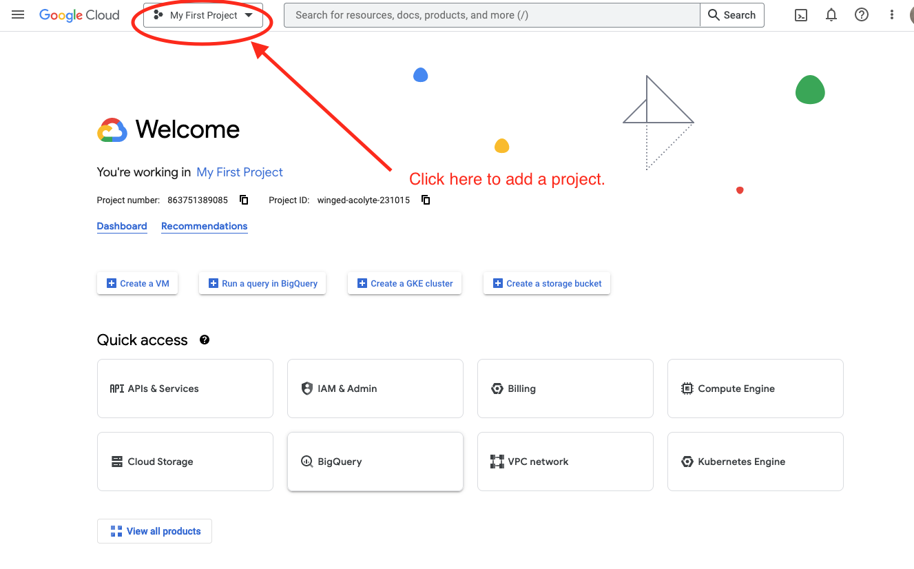
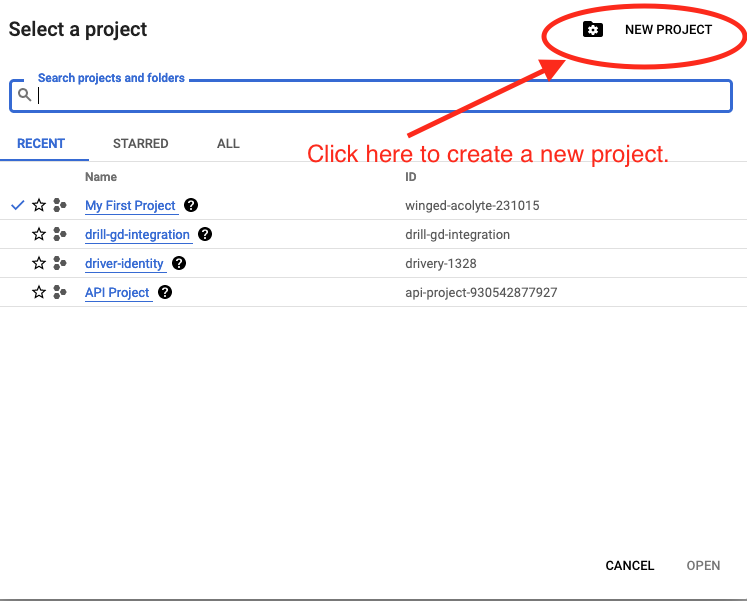
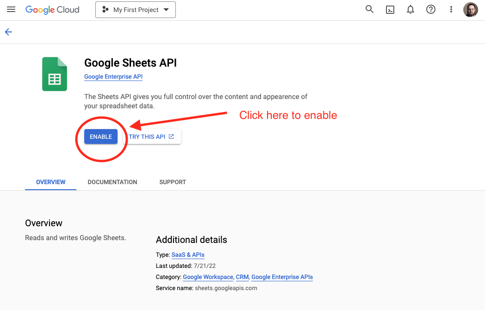
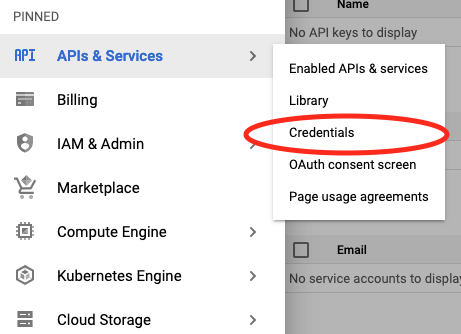
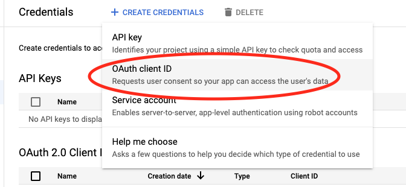
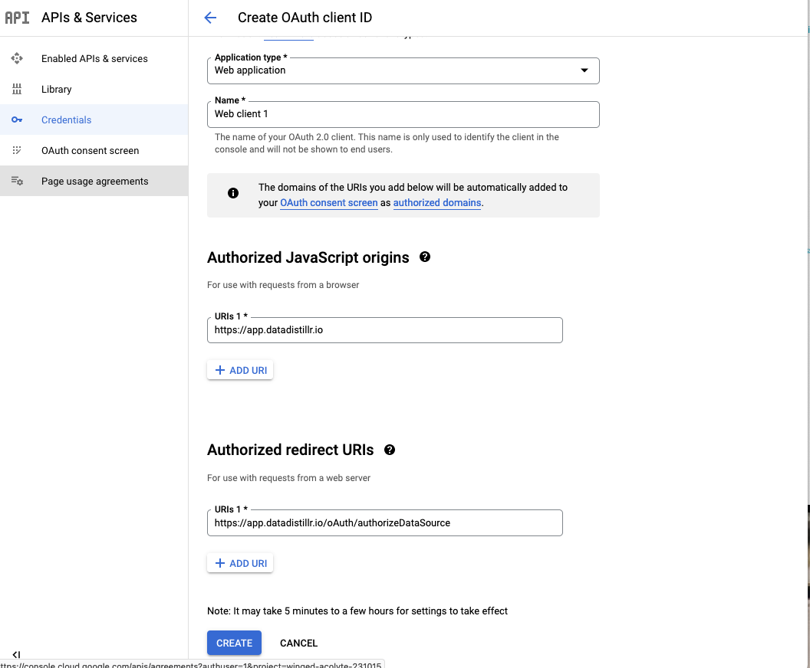
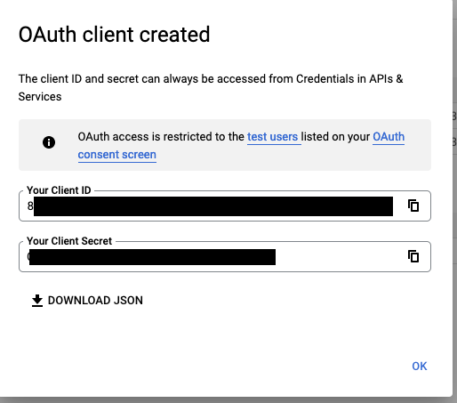
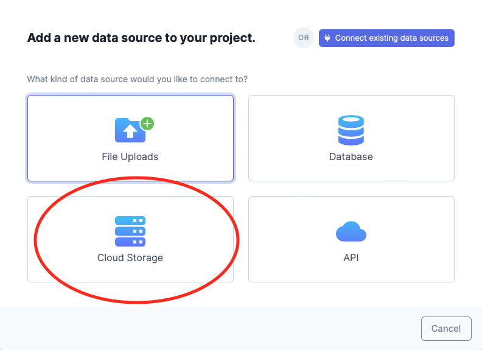
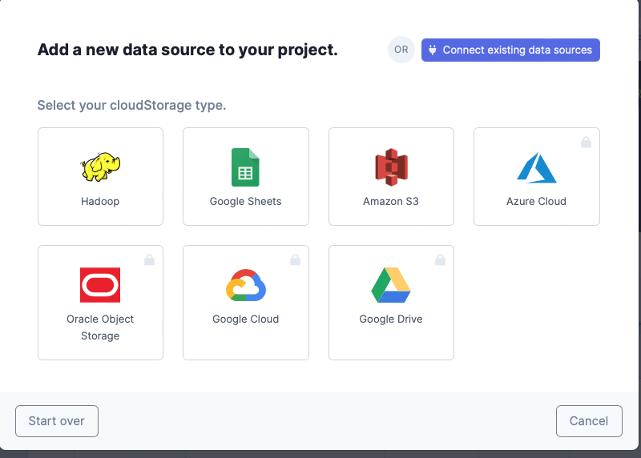
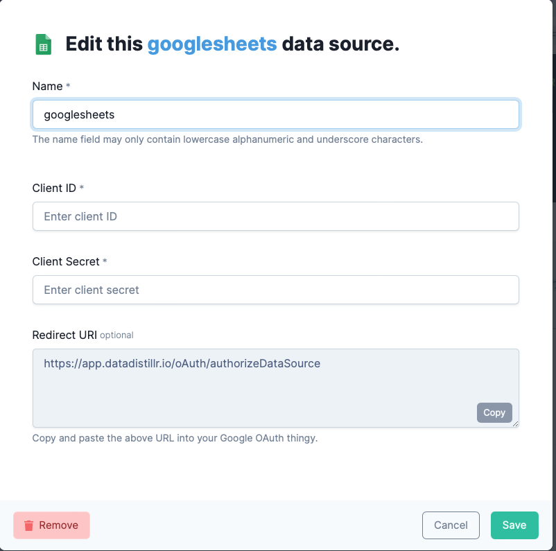

# Connecting to GoogleSheets

## First Steps with GoogleSheets: Setting Up Your Account
The first step that you will need to do in order to connect DataDistillr to GoogleSheets is enable connections from external sources.  There are three steps:

1. Create a Google cloud application
2. Enable the Drive and Sheets API with appropriate scopes
3. Obtain OAuth client tokens. 

This may seem really difficult, but it's not too tricky. 

!!! info
    
    If you have an enterprise account, the connection to enterprise level GoogleSheets and GoogleDrive can be set globally and you will not have to do this step.  Please contact support at support@datadistillr.com.

### Step 1: Creating an Application On Google Cloud
The first step is to create an application on Google Cloud.  To do this, go to https://cloud.google.com, log in and click on the `My First Project` at the top. If you already have a project, you can use that as well. 



Next, go ahead and create a project as shown in the screen shot below:


Once you've done that, we're on to step 2 which is enabling the Drive and Sheets permissions.

### Step 2:  Enabling the API Permissions
Now that we've created an application on Google Cloud, the next step is to enable the Sheets and Drive APIs.  Click on the links below and click on the `Enable` button.  Be sure to do this for both the sheets and drive APIs.

* [Enable the GoogleSheets API](https://console.cloud.google.com/apis/library/sheets.googleapis.com?)
* [Enable the GoogleDrive API](https://console.cloud.google.com/apis/library/drive.googleapis.com?)



### Step 3: Creating the Credentials
The final step is creating the OAuth credentials.  In the menu on the left, navigate to APIs & Services -> Credentials.



Then, at the top of the screen, you should see a button called `Create Credentials`.  Click on that and select `OAuth client ID`. 



It will be helpful at this point to have DataDistillr open as you'll need to copy some values from DataDistillr to Google and vice versa.  Select `Web Application` from the drop down list and you will see a scree like the one below:



You can name the client anything you want. Under the Authorized JavaScript origins, add `https://app.datadistillr.io` and for the Authorized redirect URIs, add `https://app.datadistillr.io/oAuth/authorizeDataSource`.

Once that's done, click on the `Create` button at the bottom of the screen.



At this point, you are now ready to connect Google Sheets with DataDistillr.  Don't close this window yet, because you'll need to copy the `ClientID` and `ClientSecret` into DataDistillr. 

## Configuring DataDistillr
Ok, if you survived all that, connecting to DataDistillr is much simpler.  To add GoogleSheets to DataDistillr. GoogleSheets is considered a cloud data source, so in the select data source type, click on cloud storage.



Next, select GoogleSheets from the available data sources.



Now you should see the GoogleSheets configuration panel. Enter the clientID and clientSecret tokens you obtained earlier.  Once you click on save, you will be asked to authenticate with Google. After authenticating, you can query GoogleSheets directly in DataDistillr! 



## Querying GoogleSheets in DataDistillr
Querying GoogleSheets in DataDistillr is fundamentally no different than querying any other data source.  There is one small difference that you may notice.  GoogleSheets uses tokens to identify the files instead of their actual names.  As a result, instead of seeing the file name in your query, you will see the token, which is not human readable. 

For instance, a query may look like this:

```sql
SELECT * 
FROM googlesheets.`2384reiowhoiaehliqyruehlfah243r238e`.`Sheet1`
```
The Nav Tree on the left will display the readable file names so you should use that to select the file you wish to query.

Happy Distilling!

