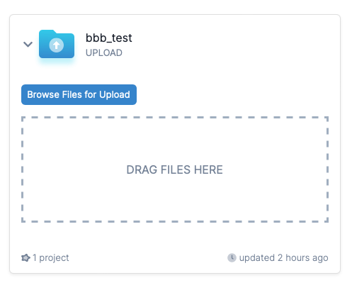

# Uploading Files

If you have files on your desktop or you want to upload individual files to DataDistillr, you can create a
_File Upload Directory_ in DataDistillr.  You can create as many upload directories as you like and associate as
many upload directories as you want with projects.

![Add an Upload Directory][image-1]

Next, fill out the name of your data source. Optionally, you can select the icon and icon color. Then, click _Save_.

![Upload Data Source Form][image-2]

If this data source wasn't created in the context of a project, you will have to [link the upload data source to your project][link-1]

## __Uploading Files__ 

Once you have created an upload file data source is that's linked to a project, you can upload files directly to
DataDistillr. Close the create data source window to view the file upload sources. From there, click on the down arrow,
and you will see an area to upload your files. You can simply drag and drop files or folders directly into DataDistillr.

!!! warning
    DataDistillr will only allow you to upload files which DataDistillr can query. If you try to upload an unsupported
    file type, you will receive an error.

<figure markdown>
  { justify-content="center" }
  <figcaption>File Uploader</figcaption>
</figure>

[image-1]: ../img/connecting-data/upload-directory.png
[image-2]: ../img/connecting-data/data-source-form.png

[link-1]: ../connecting-data/linking-data-to-your-project.md