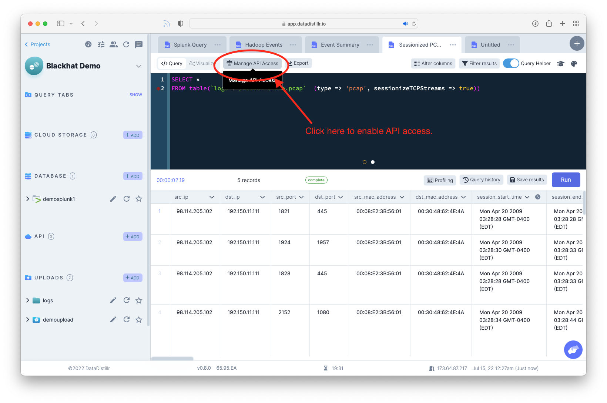
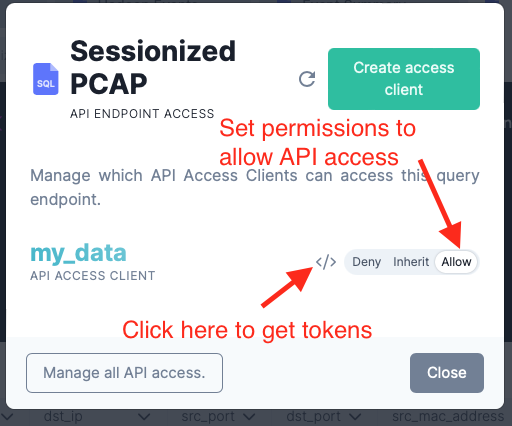
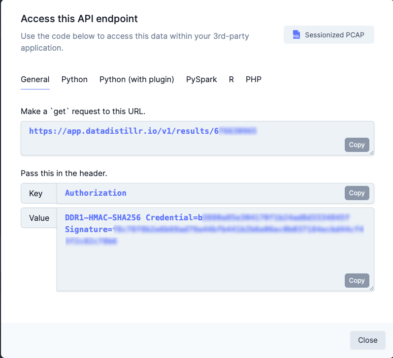
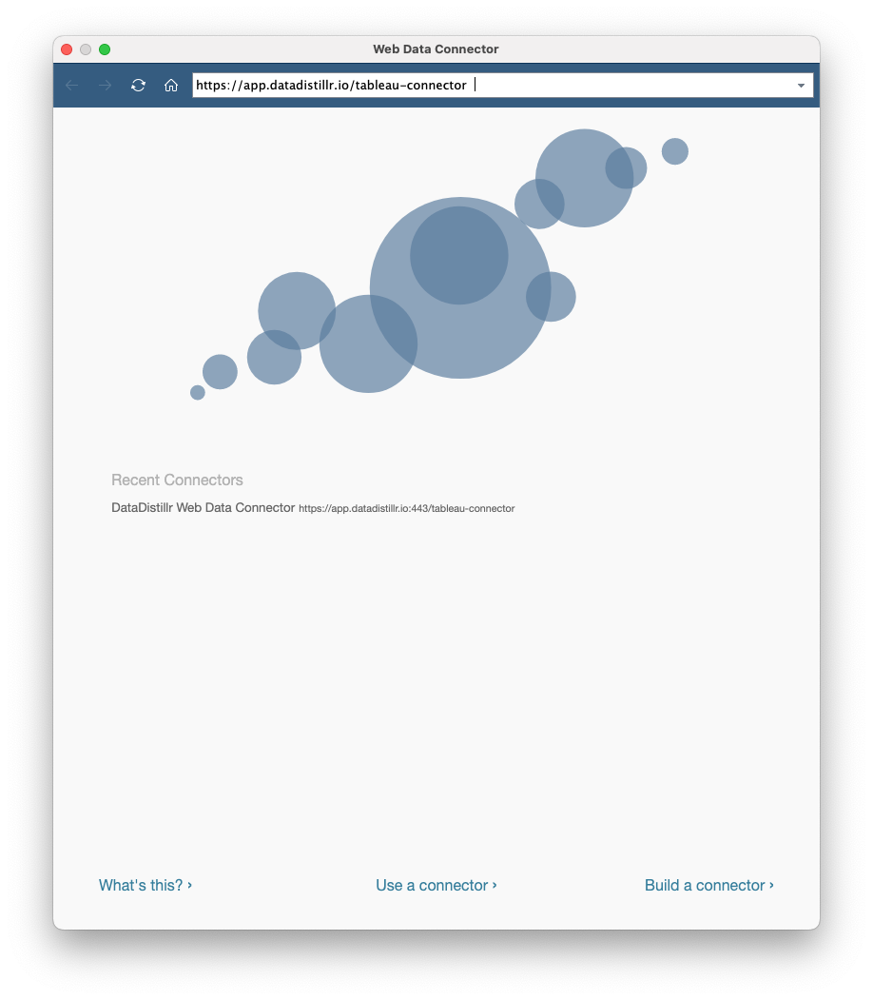
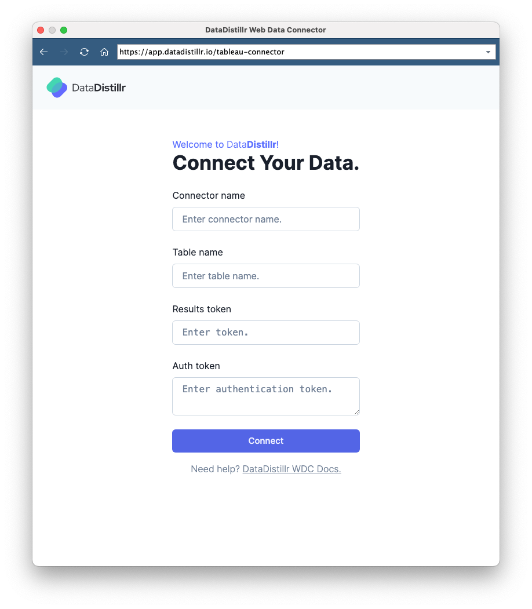
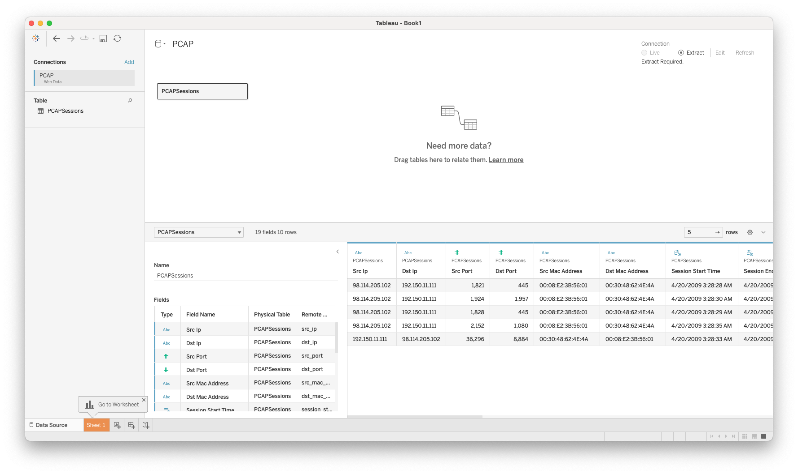

# Connecting DataDistillr to Tableau
Once you have created a dataset that you are happy with, it is quite easy to connect DataDistillr to Tableau to visualize this data using DataDistillr's Web Data Connector for Tableau.

## Step One:  Grant API Access to Your Data
In order to push data from DataDistillr to Tableau, the first step is to enable API access for the data set you wish to publish.  Click on the `Manage API Access` as shown in the screenshot below.

### Setting Permissions
Once you've opened the Manage API access window, make sure that the permission is set to `Allow` so that your data will be accessible. You can set the permissions at the project level as well and then set the individual dataset to either `inheirit` or `allow`. 

!!! warning If the permission is not set properly, you will not be able to access the data in Tableau.

## Step Two:  Obtain the Access Tokens
The next step is to obtain the access tokens from DataDistillr. As shown in the image above, click on the `</>` symbol to open the code generator.  For Tableau, there are two tokens you will need:  

* The `Results Token` is a 9 (or more) digit number which is found at the end of the `GET` request.  In the example below, the `GET` request URL is https://app.datadistillr.io/v1/results/1234567.  In this case, the `results token` is `1234567`.
* The `Auth Token`: The entire value of the `Authorization` field starting with `DDR1`.

Keep this window open as it is easier to cut and paste these values into Tableau. 

## Step Three: Configuring Tableau
Next, we will set up Tableau to connect to DataDistillr via Tableau's Web Data Connector.  Open Tableau and click on `Web Data Connector`.  For the URL, enter: `https://<your datadistillr>/tableau-connector`.  If you are using the main DataDistillr instance, the URL is `https://app.datadistillr.io/tableau-connector`.

Next, the authentication page for DataDistillr will come appear as shown below.  Enter the `access token` and the `Auth token` in the form.  You can enter whatever values you want to identify your dataset in Tableau.  

Lastly click on the `Connect` button and you should be able to see your data in Tableau!

