# Practice Basic SQL

Start off by downloading the following files then
[Connect a Data Source and Upload a File](../getting-started/connecting-a-data-source-and-uploading-a-file.md){:target="_blank"}.
!!! attachment "Dummy Data"
[Dummy Customers-1.xlsx](/img/Dummy Customers-1.xlsx)  
[Dummy Customers-2.xlsx](/img/Dummy Customers-2.xlsx)


## **Querying Data**

`SELECT`

This clause extracts data from a data source. A data source can be an uploaded file (xls, csv, json, etc.), or an
externally connected source such as a database, cloud storage, or an API.

- To return the whole table, use a `*`
- To return specific columns from a table, use the column name(s)
- You can also perform simple calculations within the `SELECT` clause

```sql
-- Display all available fields in the dataset
SELECT * 
FROM `demo_project`.`/Dummy-Customers-1.xlsx`
```

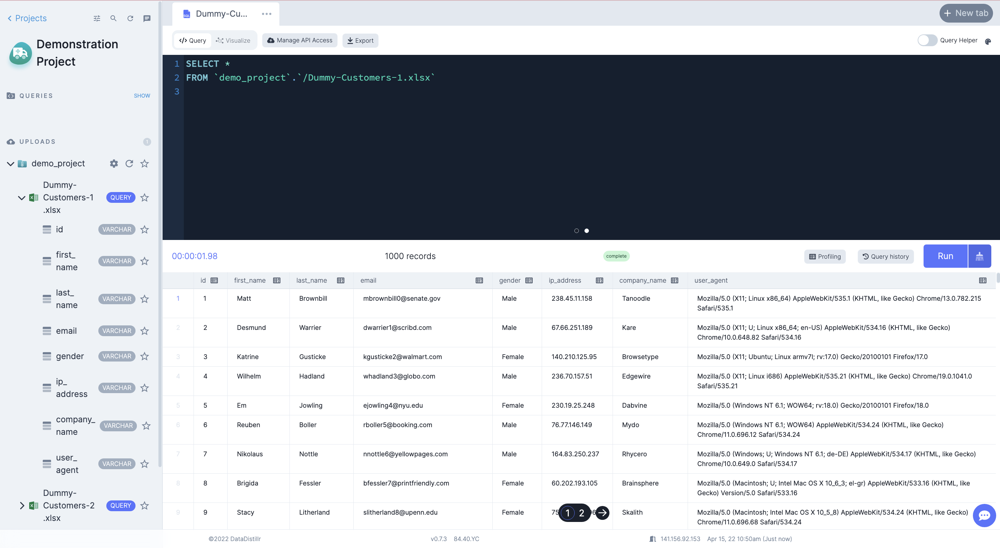

`LIMIT`

This clause constrains the number of rows returned by a `SELECT` statement.

```sql
-- Display the first 1000 rows from column first_name and ip_address
SELECT first_name, ip_address
FROM demo_project_data.`/Dummy-Customers-1.xlsx`
LIMIT 1000
```

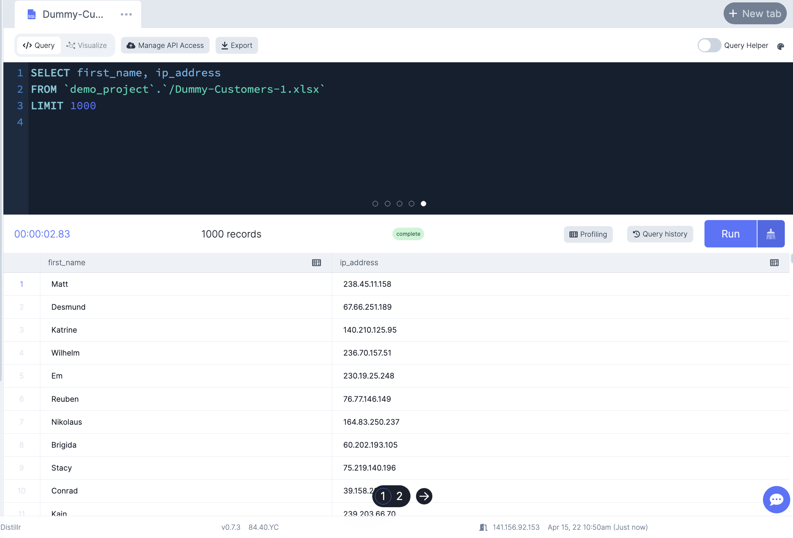

## **Sorting Data**

`ORDER BY`

This clause sorts the result set based on specified criteria in ascending or descending orders.

- By default, this sorts by in ascending order. The `ASC` keyword does the same thing.
- To change to descending order, add the `DESC` keyword after the column name

```sql
-- List client's first and last names in ascending order based on last name
SELECT first_name,last_name
FROM `demo_project`.`/Dummy-Customers-1.xlsx` 
ORDER BY last_name
```

## **Filtering Data**

`SELECT DISTINCT`

This clause filters out duplicate from the selected column or whole dataset and returns only unique records.

```sql
-- Select only unique company names from the company_name column
SELECT DISTINCT company_name
FROM demo_project_data.`/Dummy-Customers-1.xlsx`
```

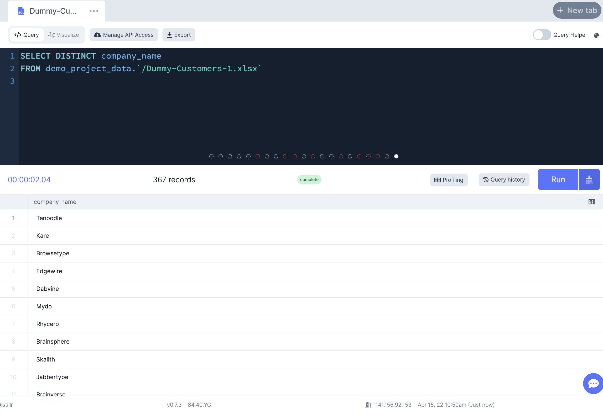

`WHERE`

This clause filters columns to extract only records that fulfill the specified condition.

```sql
-- Only select the customers from the Kare company
SELECT first_name,last_name, company_name
FROM demo_project_data.`/Dummy-Customers-1.xlsx`
WHERE company_name = 'Kare'
```

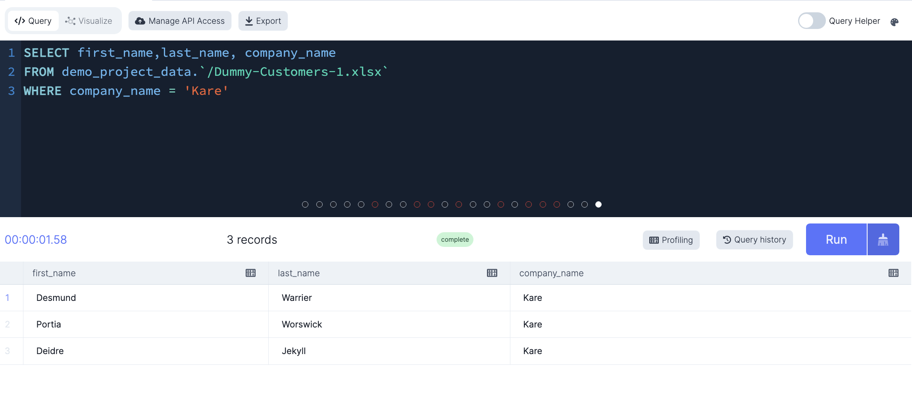

## **Operators**

You can use the following comparison operators to test if conditions are True or False

| Comparison Operators | Description           | Usage                 |
|----------------------|-----------------------|-----------------------|
| =                    | Equal                 | column = expression   |
| >                    | Greater Than          | column > expression   |
| <                    | Less Than             | column < expression   |
| >=                   | Greater Than or Equal | column >= expression  |
| <=                   | Less Than or Equal to | column <= expression  |
| <> , !=              | Not Equal to          | column != expression  |


The WHERE clause can also be combined with the following operators detailed below:

- AND
- OR
- NOT
- IN
- BETWEEN


`AND`

This operator filters records based on more than one condition and displays a record if the conditions on both sides of
the `AND` are TRUE.

```sql
-- Only select customers from the Kare company AND whose first name is Portia
SELECT first_name,last_name, company_name
FROM demo_project_data.`/Dummy-Customers-1.xlsx`
WHERE company_name = 'Kare' AND first_name = 'Portia'
```

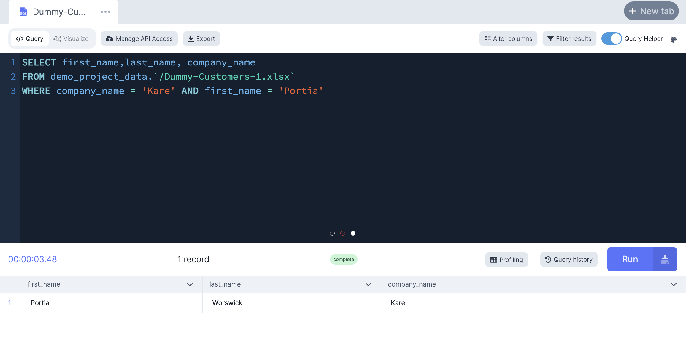

`OR`

This operator filters records based on more than one condition and displays a record if any of the conditions on either
side of the `OR` are TRUE.

```sql
-- Only select customers from the Kare company OR whose first name is Portia
SELECT first_name,last_name, company_name
FROM demo_project_data.`/Dummy-Customers-1.xlsx`
WHERE company_name = 'Kare' OR first_name = 'Portia'
```

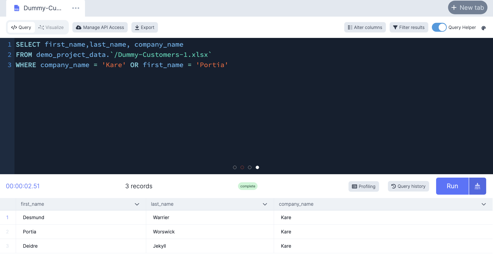

`NOT`

This operator filters records based on more than one condition and displays a record if the condition(s) is NOT TRUE.

```sql
-- Only select customers who are NOT from the Kare company
SELECT first_name,last_name, company_name
FROM demo_project_data.`/Dummy-Customers-1.xlsx`
WHERE NOT company_name = 'Kare'
```

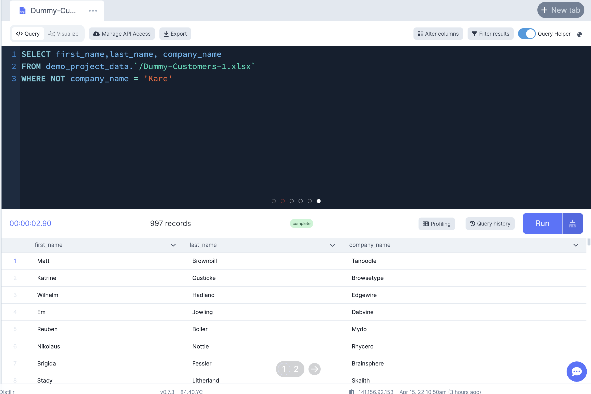

`IN`

This operator allows you to specify multiple values in a WHERE clause and can be shorthand for multiple OR conditions.

```sql
-- Only select customers from the companies Kare or Tanoodle
SELECT first_name,last_name, company_name
FROM demo_project_data.`/Dummy-Customers-1.xlsx`
WHERE company_name IN ('Kare','Tanoodle')
```

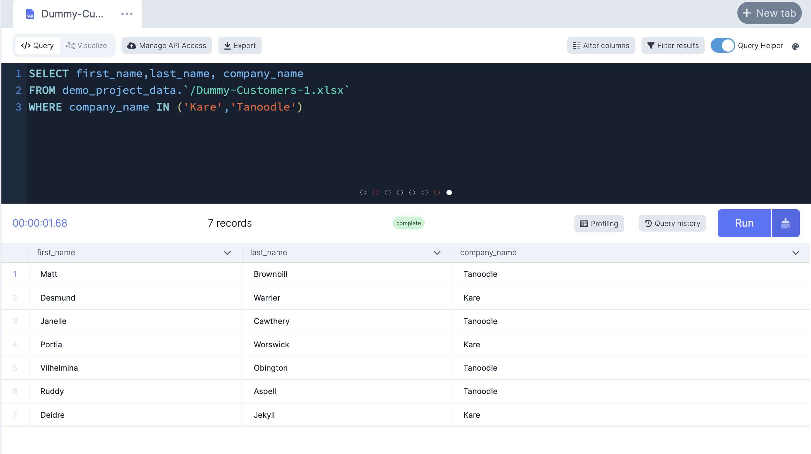

`BETWEEN`

This operator selects values within a given range. The range is inclusive meaning the begin and end values are included.
The data type can be numbers, text, or dates.

```sql
-- Select customer who's ip address are between '0.146.230.61' AND '123.110.196.5'
SELECT first_name,last_name, ip_address
FROM demo_project_data.`/Dummy-Customers-1.xlsx`
WHERE ip_address BETWEEN '0.146.230.61' AND '123.110.196.5'
```

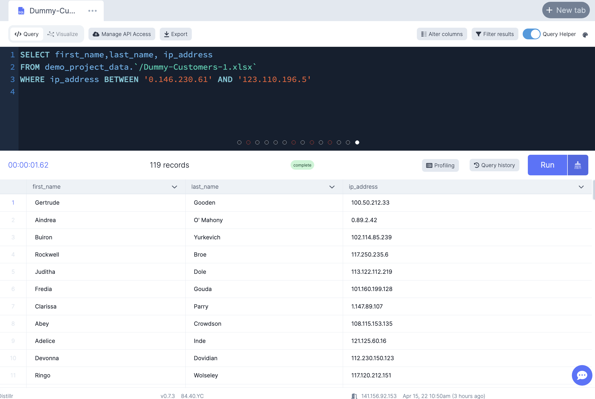

## **Joining Tables**

DataDistillr allows you to link different datasource on the platform. This will show you how to link tables
together using the `JOIN` clause which combines rows from two or more tables, based on a related column between them.
There are different types of joins in SQL:

- FULL OUTER JOIN
- INNER JOIN
- LEFT JOIN
- RIGHT JOIN
  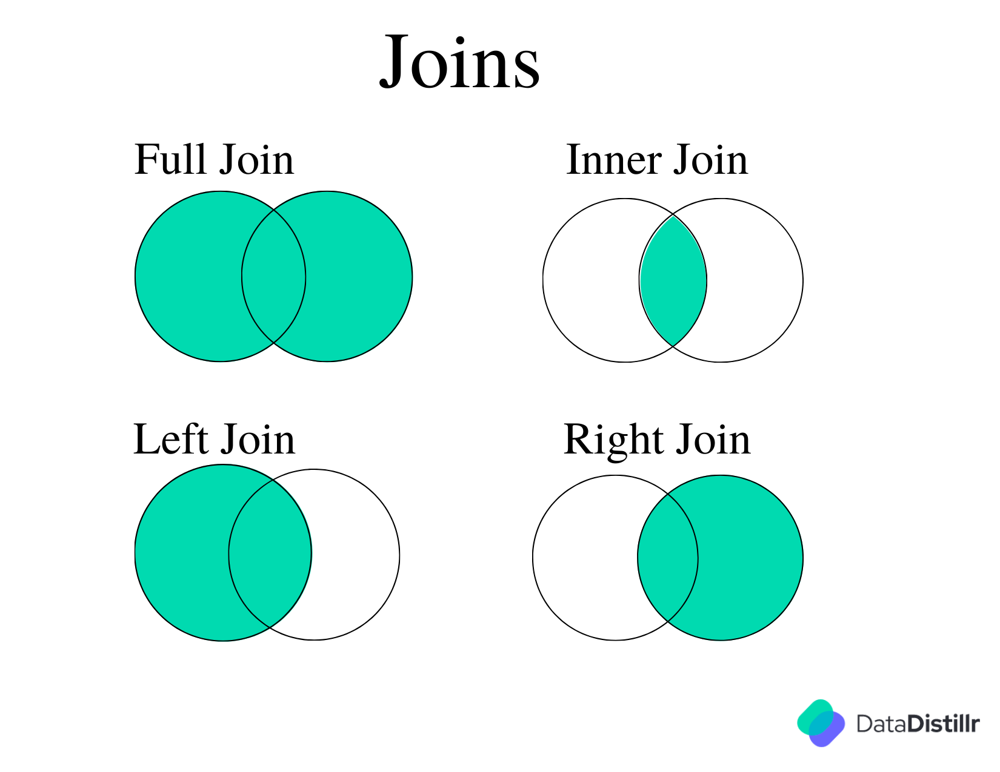

`AS`

This clause allows you to give a temporary name to a table or column through aliases. In the table join
examples below, we will demonstrate the following reasons why the `AS` clause comes in handy:

- Write clear column names for readability
- If you don't want to rewrite full column names every time you reference a column, you can rename columns to an acronym
- If you have duplicate column names across different tables, you can rename the columns to make them unique

```sql
-- Rename columns for readability
SELECT ip_address, getCountryName(ip_address) AS country
FROM demo_project_data.`/Dummy-Customers-1.xlsx`
LIMIT 1000
```

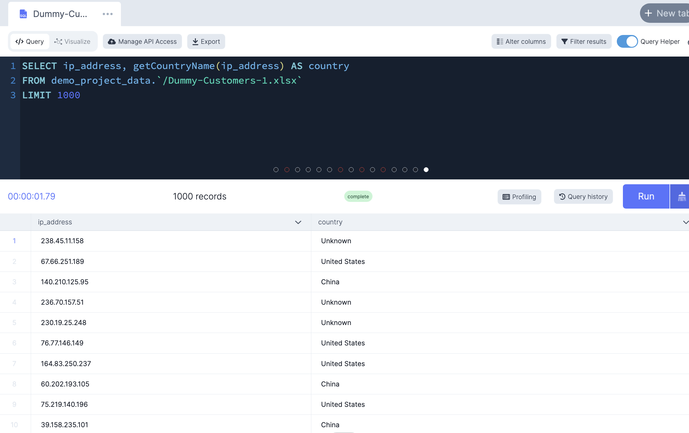

`FULL OUTER JOIN`

This join includes all rows from the joined tables whether or not the other table has the matching row

```sql
-- Full join of two tables based on id number, should return everything
SELECT
    c1.first_name,
    c1.email,
    c2.first_name AS first_name1, 
    c2.email AS email2
FROM `demo_project`.`/Dummy-Customers-1.xlsx` AS c1 
FULL OUTER JOIN `demo_project`.`/Dummy-Customers-2.xlsx` AS c2 
ON c1.id = c2.id

```

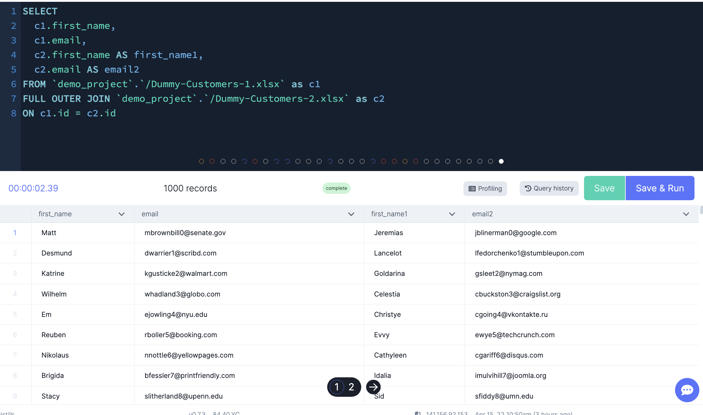

`INNER JOIN`

This join returns rows if there is, at least, one row in both tables that matches the join condition. This eliminates
the rows that do not match with a row of the other table

For each row in column_name1, the inner join clause finds the matching rows in column_name2. If a row is matched, it is
included in the final result set.

```sql
-- Inner join both tables based company name
SELECT *
FROM `demo_project`.`/Dummy-Customers-1.xlsx` AS customer1
INNER JOIN `demo_project`.`/Dummy-Customers-2.xlsx` AS customer2
ON customer1.id = customer2.id
```

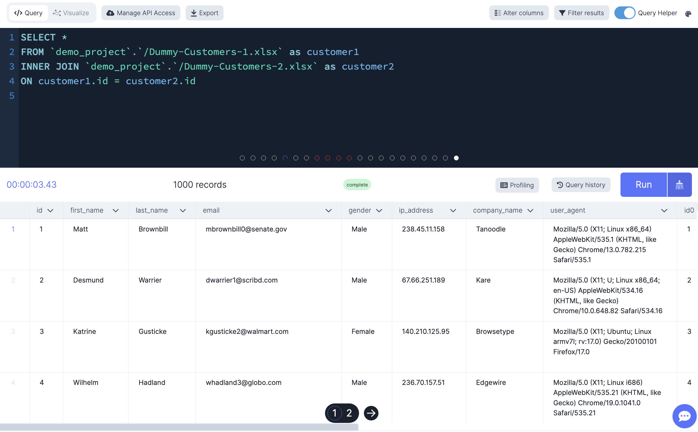

The query below shouldn't return anything because first names are not repeated in both tables

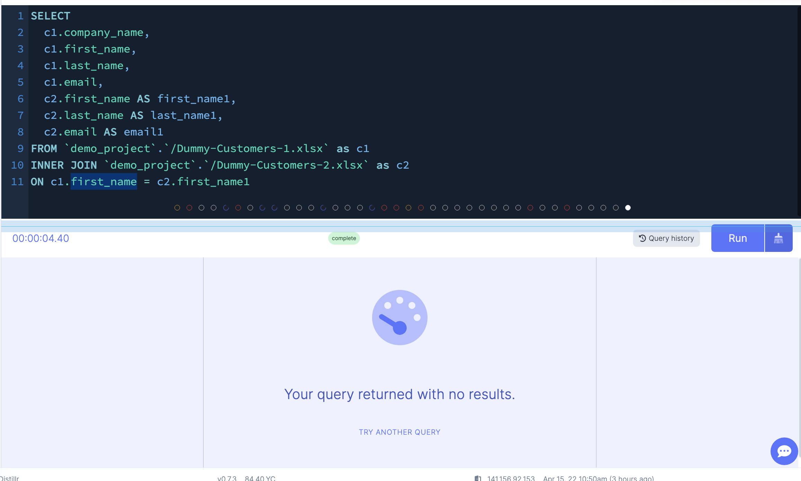

`LEFT JOIN`

This join returns all rows from the left table regardless of whether there is a matching row in the right table.

```sql
-- Left join tables based on the same fist name. Only 7 People have the same name.
SELECT *
FROM `demo_project`.`/Dummy-Customers-1.xlsx` as customer1
LEFT JOIN `demo_project`.`/Dummy-Customers-2.xlsx` as customer2
ON customer1.first_name = customer2.fist_name
```

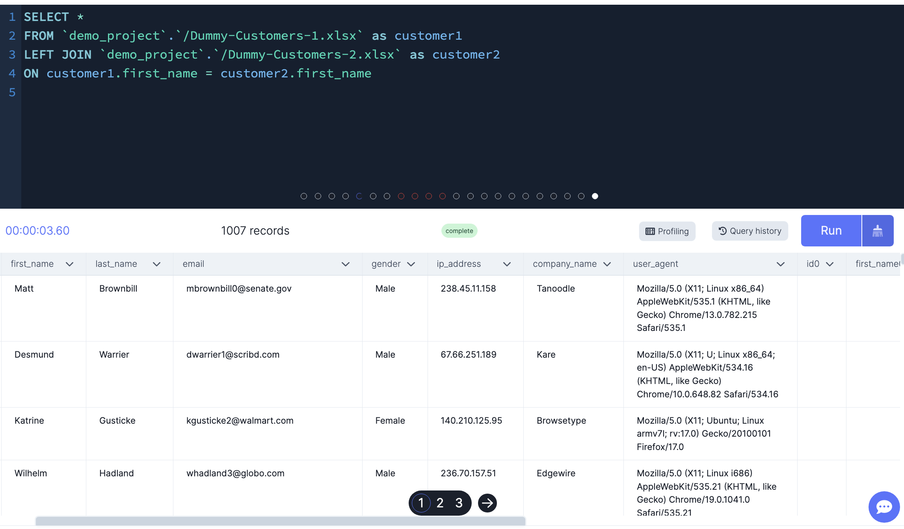

`RIGHT JOIN`

This clause returns all rows from the right table whether or not there is a matching row in the left table.

```sql
-- Right join based on first name. Only 7 people have the same first name
SELECT *
FROM `demo_project`.`/Dummy-Customers-1.xlsx` as customer1
RIGHT JOIN `demo_project`.`/Dummy-Customers-2.xlsx` as customer2
ON customer1.first_name = customer2.first_name
```

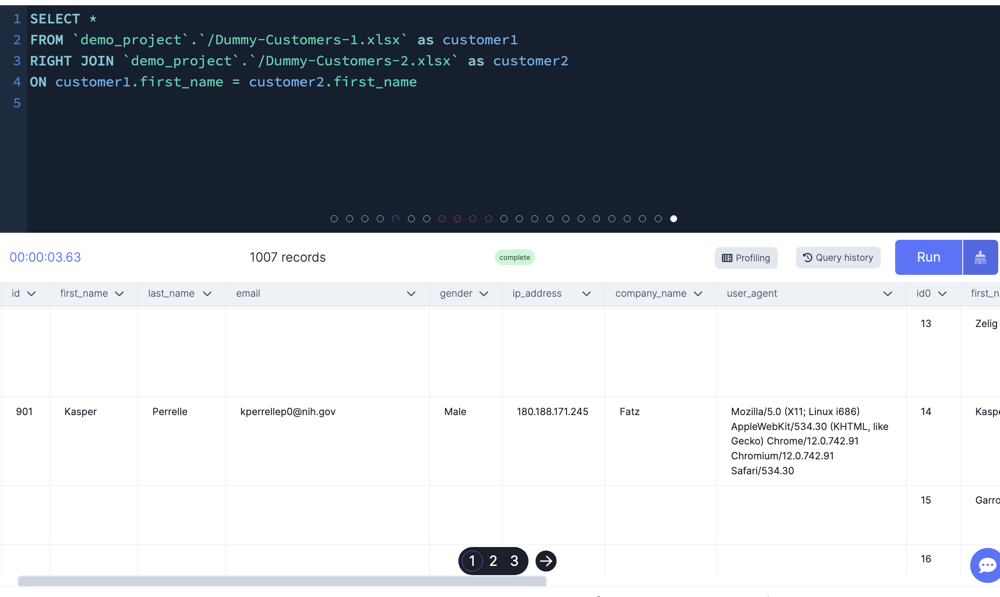

## **Aggregate Functions**

SQL has built-in functions that allow you to perform basic calculations on your dataset detailed below:

- MIN()
- MAX()
- COUNT()
- AVG()
- SUM()

`MIN()`

This function returns the smallest value of the selected column.

```sql
-- smallest ip_address
SELECT MIN(ip_address)
FROM demo_project_data.`/Dummy-Customers-1.xlsx`
```

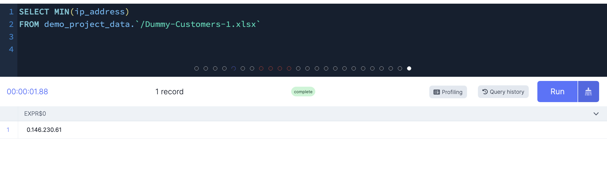

`MAX()`

This function returns the largest value of the selected column.

```sql
-- Largest ip_address
SELECT MAX(ip_address)
FROM demo_project_data.`/Dummy-Customers-1.xlsx`
```

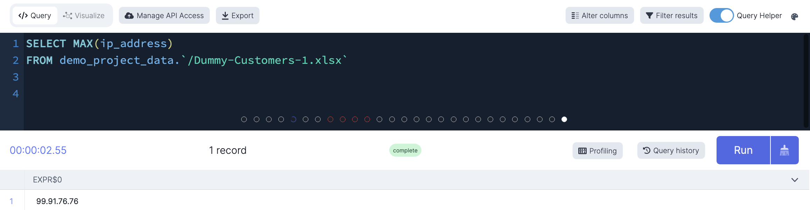

`COUNT()`

This function returns the number of rows that matches a specified criterion.

```sql
-- Count the number of first names in the dataset
SELECT COUNT(first_name)
FROM demo_project_data.`/Dummy-Customers-1.xlsx`
```
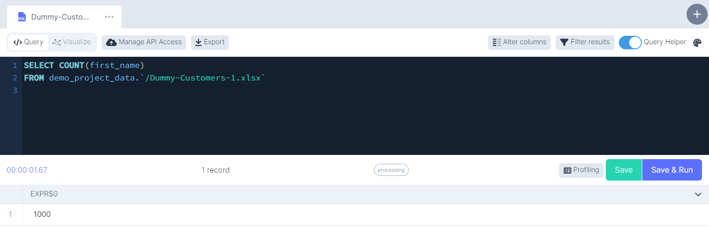


`AVG()`

This function returns the average value of a numeric column. This calculates the average value of a set.

```sql
-- Calculate the average value of the column
SELECT AVG(column_name)
FROM demo_project_data.`/Dummy-Customers-1.xlsx`
```

`SUM()`

This function returns the total sum of a numeric column only. This can be distinct values or all values within the column

```sql
-- Calculate the sum of the numeric column selected
SELECT SUM(column_name)
FROM demo_project_data.`/Dummy-Customers-1.xlsx` 
```